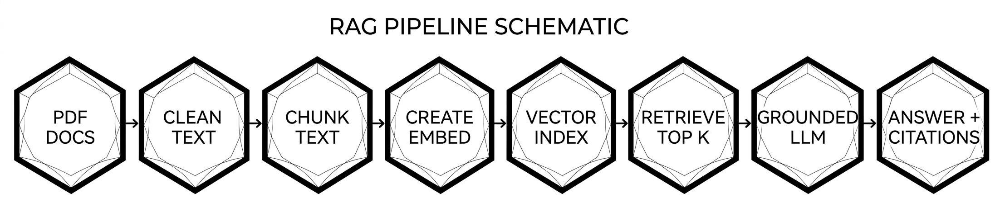

# FinTech Customer Support Assistant

A document-grounded customer-support assistant built with Retrieval-Augmented Generation (RAG). It answers questions only from the provided FinBase PDFs, cites the exact document, section and page for each answer, and says so when the knowledge base does not contain the answer.

> **Deployment note:** this project is not deployed to a public URL because the company did not approve hosting. It runs locally with the steps below, and the explanation video demonstrates the working application.

## Architecture



```text
PDFs ─► extract (text + tables) ─► clean ─► section-aware chunks (with citation metadata)
     ─► local embeddings (bge-small) ─► Chroma (persistent, cosine)

Question (+ chat history)
     ─► follow-up rewrite ─► dense search ┐
                                          ├─► reciprocal-rank fusion ─► cross-encoder rerank
                          BM25 search    ┘                                   │
     ◄─ answer + verified citations ◄─ grounded Grok prompt ◄─ relevance gate (cosine threshold)
```

| Stage | Choice | Why |
|---|---|---|
| Extraction | `pdfplumber` | Reads tables as rows (pypdf returns one cell per line) and lets glyphs be repaired per character (the PDFs draw `₹` with a symbol font that otherwise becomes `■`). |
| Chunking | Structure-aware: one chunk per section, sub-section or FAQ item; oversized sections are packed by lines up to `CHUNK_MAX_WORDS` with overlap; tables are never split | Policy documents are organised by numbered clauses. Chunking on that structure makes every chunk citable as *Document — Section 6.2, p. 3* and keeps a rule and its numbers together. Each chunk starts with a breadcrumb (document › section) so it is self-describing. |
| Embeddings | `BAAI/bge-small-en-v1.5` via sentence-transformers, run locally | xAI has no dependable embeddings API, so embeddings run on your machine: free, no extra API key, no document text leaves the machine for indexing, and it is a strong small retrieval model. Queries get BGE's retrieval instruction prefix. |
| Vector store | Chroma (persistent, cosine distance) | A real vector database with metadata support, no server to run. The index is rebuilt automatically when the PDFs, embedding model or chunk settings change. |
| Retrieval | Dense + BM25 fused with reciprocal rank fusion, then a cross-encoder reranker (`ms-marco-MiniLM-L-6-v2`) | The corpus mixes prose with exact identifiers and numbers (for example `MET-PL-1301`). Dense search handles paraphrases, BM25 handles exact terms, the reranker fixes the final order. Falls back to hybrid automatically if the reranker cannot load. |
| LLM | xAI Grok (`grok-4-fast-non-reasoning` by default), temperature 0, via the OpenAI-compatible API | Fast and inexpensive; the non-reasoning variant gives short, deterministic, grounded answers with no hidden reasoning tokens. |
| Memory | The UI sends the last few messages; the API rewrites a follow-up ("and after 24 months?") into a standalone question before retrieval | Stateless API, no session storage, and follow-ups retrieve correctly. |

### Hallucination mitigation

1. **Relevance gate.** If the best chunk's cosine similarity is below `MIN_SIMILARITY`, the assistant refuses without calling the LLM.
2. **Grounding prompt.** Answer only from numbered passages, cite `[S#]` after each fact, otherwise reply `NOT_FOUND`.
3. **Citation verification.** Every `[S#]` marker is checked against the retrieved set. Invalid markers are removed and answers without verifiable citations are flagged in the API (`citations_verified`) and the UI.
4. **Honest sources.** Refusals return no sources; answers list the cited passages first, then other retrieved passages.

### Data-quality finding

The FAQ entries in the PDFs sometimes cite a different section number than the section that actually holds the rule (for example the personal-loan FAQ says "Section 4.2" for foreclosure, which is actually Section 6.2). The assistant cites the **real** section and page of the chunk it used, and shows FAQ items as `FAQ Q001 (Section 23)`. The prompt tells the model not to repeat section numbers found inside passage text.

## Requirements

- Python 3.11
- An xAI (Grok) API key
- The knowledge-base PDFs in `backend/data/`

## Local setup

```bash
python3.11 -m venv .venv            # Windows: py -3.11 -m venv .venv
source .venv/bin/activate            # Windows: .venv\Scripts\activate
python -m pip install -r backend/requirements.txt
cp backend/.env.example backend/.env   # then set XAI_API_KEY
```

Start the API and the UI in two terminals (from the repository root):

```bash
uvicorn app.main:app --app-dir backend --reload
streamlit run frontend/app.py
```

The first start downloads the embedding model (about 130 MB) and builds the index (about 750 chunks, one-off); later starts reuse both. The UI uses `http://localhost:8000` unless `API_URL` is set. Interactive API docs: `/docs`. The reranker model (about 90 MB) downloads from Hugging Face on first use; if it is unavailable the API logs a warning and serves hybrid results.

## Configuration

| Variable | Default | Purpose |
|---|---|---|
| `XAI_API_KEY` | — | xAI API key (required) |
| `XAI_MODEL` | `grok-4-fast-non-reasoning` | Answer generation, query rewriting and evaluation judge. Confirm the exact model id in the xAI console |
| `XAI_BASE_URL` | `https://api.x.ai/v1` | OpenAI-compatible endpoint |
| `EMBEDDING_MODEL` | `BAAI/bge-small-en-v1.5` | Local sentence-transformers embedding model |
| `EMBEDDING_QUERY_PREFIX` | auto | Query-side instruction; set automatically for BGE English models |
| `RETRIEVAL_MODE` | `hybrid_rerank` | `dense`, `hybrid` or `hybrid_rerank` |
| `RERANKER_MODEL` | `cross-encoder/ms-marco-MiniLM-L-6-v2` | Cross-encoder used for reranking |
| `TOP_K` | `5` | Passages sent to the LLM |
| `CANDIDATE_K` | `20` | Candidates fetched from each retriever before fusion |
| `RERANK_POOL` | `12` | Fused candidates passed to the reranker |
| `MIN_SIMILARITY` | `0.40` | Refuse without calling the LLM below this top cosine similarity (calibrate, see below) |
| `CHUNK_MAX_WORDS` | `250` | Maximum chunk size, in words |
| `CHUNK_OVERLAP_WORDS` | `40` | Overlap between split chunks of one section, in words |
| `HISTORY_TURNS` | `6` | Previous messages used for follow-up rewriting |
| `RAG_DATA_DIR` / `RAG_INDEX_DIR` | `backend/data` / `backend/storage` | PDF folder (scanned recursively) / persisted index |

Keep API keys in `.env`, never in source control.

## API

`POST /chat`

```json
{
  "question": "And what if I close it after 24 months?",
  "history": [
    {"role": "user", "content": "What is the foreclosure charge before 24 months?"},
    {"role": "assistant", "content": "3% of the outstanding principal."}
  ],
  "retrieval_mode": "hybrid_rerank"
}
```

`history` and `retrieval_mode` are optional. The response contains:

| Field | Meaning |
|---|---|
| `answer` | Answer text with `[S#]` citation markers, or the not-found message |
| `sources[]` | `label` (document — section, page), `section`, `pages`, `file_name`, `excerpt`, `similarity`, `cited` |
| `refused` / `route` | Whether the assistant declined, and why (`rag`, `catalog`, `gate_refusal`, `llm_refusal`) |
| `retrieval_score` | Top dense cosine similarity |
| `citations_verified` | All citations valid and at least one present |
| `standalone_question` | The question actually retrieved on (after follow-up rewriting) |
| `retrieval_mode`, `timings` | Strategy used and per-stage latency in seconds |

Other endpoints: `GET /health`, `GET /`. Questions that ask to list the available documents are answered from the index catalogue (`route: "catalog"`).

## Evaluation

`backend/eval/eval_set.jsonl` holds 47 questions written from the PDFs: 32 single-fact, 2 multi-chunk, 3 follow-ups (with chat history) and 10 unanswerable questions (topics that are absent from the corpus, such as home loans or the CEO). Every gold section and expected fact is verified against the real PDFs by `tests/test_eval_set.py`.

```bash
cd backend
python evaluate.py                       # ablation + end-to-end metrics (uses Grok)
python evaluate.py --retrieval-only      # retrieval ablation only (local query embeddings only)
python evaluate.py --limit 10 --sleep 2  # smoke test / free-tier friendly
```

| Area | Metric | How it is measured |
|---|---|---|
| Retrieval quality | Hit@1/3/5, Recall@5, MRR | Gold section(s) present in the top-k chunks; ablation across `dense`, `hybrid`, `hybrid_rerank` |
| Answer correctness | Fact match, judge correctness | Key facts present in the answer (deterministic); LLM judge versus a reference answer |
| Groundedness | Supported-claim rate | LLM judge checks each claim against the cited passages |
| Citation accuracy | Validity, hit rate, precision | Markers resolve to retrieved passages; cited chunks include the gold section; share of cited chunks that are gold |
| Hallucination control | Refusal rate on unanswerable, false-refusal rate on answerable | Direct counts |
| Cost / latency | Mean and p95 latency per question | Wall-clock |

Results are written to `backend/eval/results/` (JSON and Markdown). The judge uses the same Grok model as the generator, so treat its scores as relative comparisons between pipeline variants.

**Calibrating `MIN_SIMILARITY`:** the report prints the top-similarity range for answerable and unanswerable questions plus two thresholds: one that never blocks a valid question and one that best separates the two groups. Set `MIN_SIMILARITY` from that output. Unanswerable questions about nearby topics (for example "home loan rate") score close to real questions, so the gate catches off-topic queries and the grounding prompt catches the rest.

## Tests

```bash
python -m pip install -r backend/requirements-dev.txt
cd backend && python -m pytest -q
```

The suite (ingestion, retrieval, engine, API, evaluation harness, dataset integrity) runs offline with a deterministic fake embedder and a scripted LLM, so it needs no API key or model download.

## Docker (optional)

```bash
docker build -t fintech-rag-assistant .
docker run --rm -p 8000:8000 --env-file backend/.env \
  -v "$PWD/backend/data:/app/backend/data" \
  -v "$PWD/backend/storage:/app/backend/storage" \
  fintech-rag-assistant
```

Run the Streamlit frontend separately with `API_URL=http://localhost:8000`.

## Project layout

```text
backend/app/config.py       validated settings
backend/app/ingestion.py    PDF extraction, cleaning, section-aware chunking
backend/app/embeddings.py   local sentence-transformers embedder
backend/app/llm.py          Grok (OpenAI-compatible) chat client
backend/app/index_store.py  Chroma index build / reuse
backend/app/retrieval.py    dense, BM25, RRF fusion, cross-encoder rerank
backend/app/rag_engine.py   rewrite, gate, grounded prompt, citation checks
backend/app/main.py         FastAPI service
backend/evaluate.py         evaluation harness
backend/eval/eval_set.jsonl evaluation questions
backend/tests/              offline test suite
frontend/app.py             Streamlit chat UI
```
