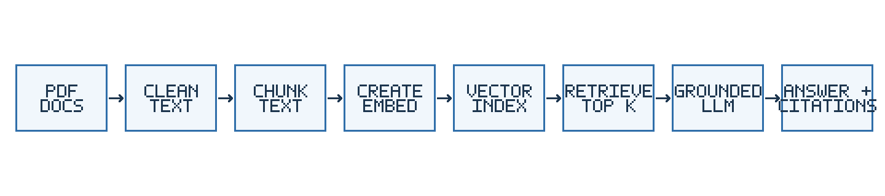

# FinTech Customer Support Assistant

A document-grounded question-answering application for financial support content. PDFs are parsed and cleaned, split into overlapping chunks, embedded and indexed with LlamaIndex. FastAPI retrieves relevant passages and generates an answer with source citations; a Streamlit chat interface displays the answer and its references.

## Architecture



```text
PDFs → Clean & chunk → Gemini embeddings → persisted vector index
     → similarity retrieval → grounded LLM answer + source citations
```

The index is stored locally and rebuilt when the PDF contents or embedding model change. Answers use retrieved context only; when the context is insufficient, the assistant is instructed to say that it could not find the information. The default models are `gemini-embedding-001` and `gemini-2.5-flash`.

## Requirements

- Python 3.11
- A Gemini API key (used for embeddings and answer generation)
- Financial PDF documents you are permitted to process

## Local setup

From the repository root:

```bash
python3.11 -m venv .venv        # Windows: py -3.11 -m venv .venv
source .venv/bin/activate        # Windows: .venv\Scripts\activate
python -m pip install -r backend/requirements.txt
```

Add your Gemini API key to the existing `backend/.env` file (use `backend/.env.example` only as a template if needed), then place the assignment PDFs in `backend/data/` (subdirectories are scanned too). The app uses Gemini for both answer generation and embeddings. The first chat request builds the local index; switching embedding models rebuilds it. Start the API and the Streamlit UI in separate terminals:

```bash
uvicorn app.main:app --app-dir backend --reload
```

```bash
streamlit run frontend/app.py
```

The UI defaults to `http://localhost:8000`. Override the API origin with `API_URL` if needed. API health is available at `/health`; interactive API documentation is at `/docs`.

## Configuration

See [`backend/.env.example`](./backend/.env.example) for all supported settings. Gemini API quotas and rate limits depend on your Google AI plan and model.

| Variable | Default | Purpose |
|---|---|---|
| `GEMINI_API_KEY` | — | Google AI Studio API key |
| `GEMINI_MODEL` | `gemini-2.5-flash` | Answer-generation model |
| `GEMINI_EMBEDDING_MODEL` | `gemini-embedding-001` | Embedding model |
| `SIMILARITY_TOP_K` | `4` | Retrieved chunks per question |
| `CHUNK_SIZE` | `768` | Chunk size in tokens |
| `CHUNK_OVERLAP` | `100` | Overlap in tokens |
| `RAG_DATA_DIR` | `backend/data` | PDF input directory |
| `RAG_INDEX_DIR` | `backend/storage` | Persisted index directory |

Keep API keys in `.env`, never in source control. The service returns a clear error if the key or PDF corpus is missing.

## API

`POST /chat`

```json
{"question": "What is the foreclosure charge?"}
```

The response contains an `answer` and a `sources` array. Each source includes its filename, optional page, retrieval score, and excerpt. Requests are stateless; conversation history is displayed by the UI but is not sent as model context.

Questions asking to list or name all policies are answered from the first-page titles of every PDF in the knowledge base, so the inventory includes documents beyond the similarity-retrieval limit.

## Evaluation

Create a JSON Lines file with one case per line. `expected_sources` is optional; source names are matched as case-insensitive substrings of the retrieved filenames.

```json
{"question":"What is the loan fee?","expected_answer":"The fee is stated in the loan policy.","expected_sources":["loan-policy.pdf"]}
```

Run from the repository root after configuring the API and adding PDFs:

```bash
PYTHONPATH=backend python backend/evaluate.py --cases backend/data/evaluation.jsonl
```

The script reports mean answer token F1 (a lexical-overlap proxy, not semantic correctness) and source hit rate for cases with expected sources. Review the generated answers and citations manually as part of evaluation; these simple metrics do not by themselves establish groundedness or factual accuracy.

## Docker

Build and run the API container from the repository root:

```bash
docker build -t fintech-rag-assistant .
docker run --rm -p 8000:8000 \
  --env-file backend/.env \
  -v "$PWD/backend/data:/app/backend/data" \
  -v "$PWD/backend/storage:/app/backend/storage" \
  fintech-rag-assistant
```

Run the Streamlit frontend separately with the local Python setup and `API_URL=http://localhost:8000`.
